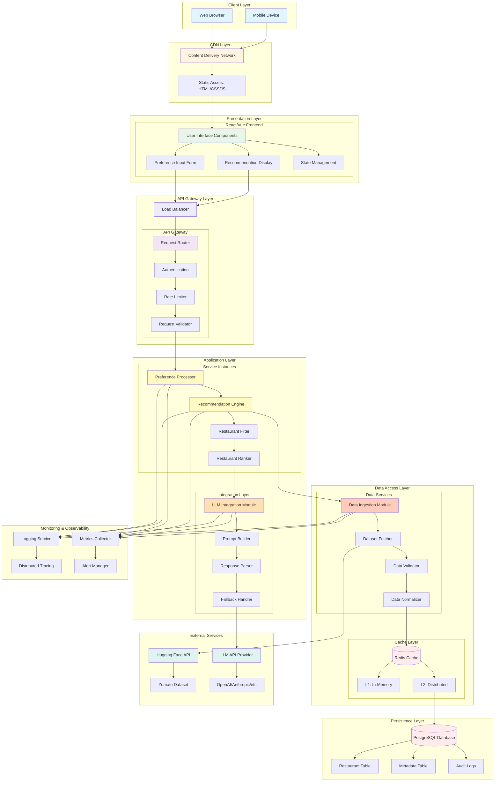
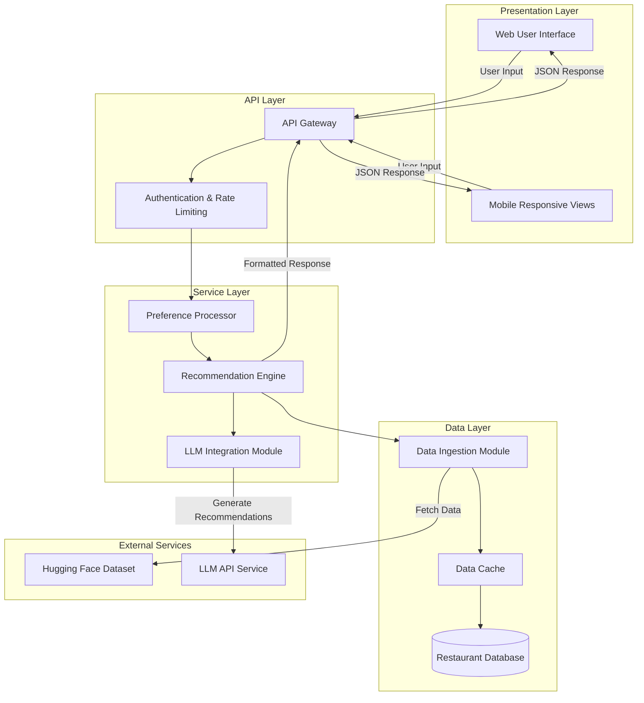
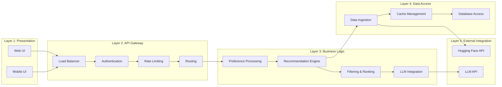
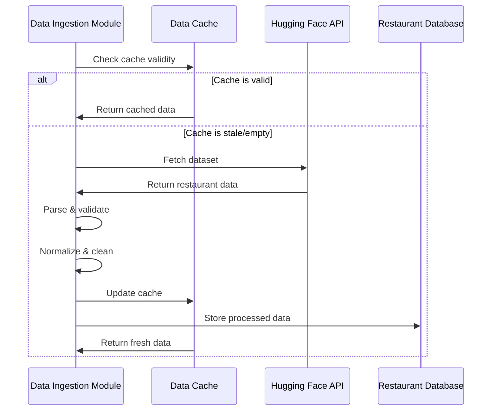
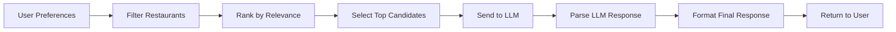
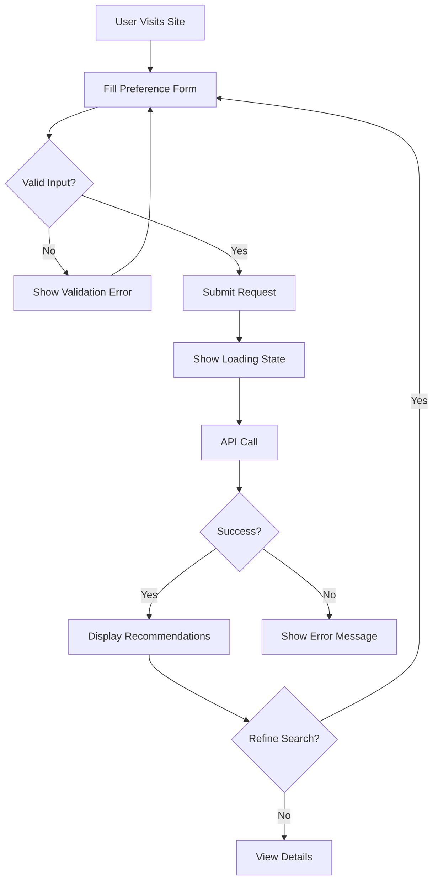
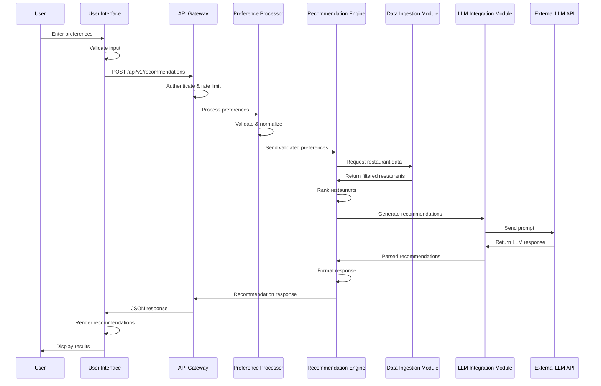
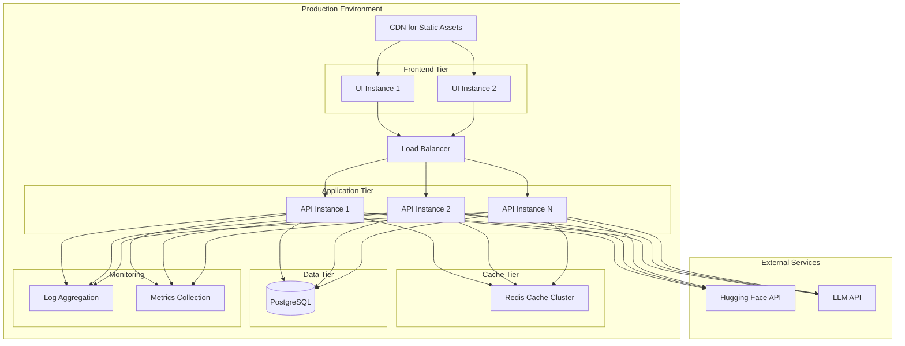

# Architecture Overview: AI Restaurant Recommendation Service

## System Architecture

This document provides a comprehensive architectural view of the AI Restaurant Recommendation Service, including component diagrams, data flow, and phased development approach.

## System Architecture Diagram (Detailed)



## High-Level Architecture Diagram



## Layered Architecture View



## Component Architecture

### 1. API Gateway
**Responsibility:** Entry point for all client requests, handles routing, authentication, and rate limiting.

**Key Functions:**
- Request validation and routing
- API versioning management
- Rate limiting and throttling
- Response formatting
- Error handling and logging

**Interfaces:**
- REST API endpoints (JSON)
- OpenAPI specification documentation

### 2. Preference Processor
**Responsibility:** Validates and normalizes user preferences.

**Key Functions:**
- Input validation
- Default value assignment
- Preference normalization
- Error message generation

**Input:** Raw user preferences (price, location, ratings, cuisine)
**Output:** Validated and normalized preference object

### 3. Data Ingestion Module
**Responsibility:** Fetches, processes, and caches restaurant data from Hugging Face.

**Key Functions:**
- Dataset fetching from Hugging Face
- Data parsing and validation
- Data normalization and cleaning
- Caching strategy implementation
- Deduplication

**Data Flow:**


### 4. LLM Integration Module
**Responsibility:** Interfaces with the LLM to generate intelligent recommendations.

**Key Functions:**
- Prompt engineering and formatting
- LLM API communication
- Response parsing
- Retry logic with exponential backoff
- Fallback mechanism

**Prompt Structure:**
```
User Preferences:
- Price Range: [value]
- Location: [value]
- Minimum Rating: [value]
- Cuisine Type: [value]

Available Restaurants:
[Filtered restaurant list with details]

Task: Recommend the top 5 restaurants that best match the user's preferences.
Provide a brief explanation for each recommendation.
```

### 5. Recommendation Engine
**Responsibility:** Core orchestration component that combines filtering, ranking, and LLM-based recommendation generation.

**Key Functions:**
- Restaurant filtering based on preferences
- Ranking algorithm implementation
- LLM integration orchestration
- Response formatting
- Explanation generation

**Processing Pipeline:**


### 6. User Interface
**Responsibility:** Provides visual interface for users to input preferences and view recommendations.

**Key Functions:**
- Preference input form with validation
- Real-time form validation feedback
- Loading state management
- Restaurant recommendation display
- Responsive design for multiple devices
- Error message display
- Search refinement capabilities

**UI Components:**
- Preference Input Form (price, location, ratings, cuisine)
- Loading Spinner
- Recommendation Cards (restaurant details)
- Error Alert Component
- Filter/Refinement Panel
- Restaurant Detail Modal

**User Flow:**


## Data Flow Architecture

### End-to-End Request Flow



## Phased Development Plan

### Phase 1: Data Ingestion (Foundation)
**Objective:** Establish data pipeline from Hugging Face dataset

**Components:**
- Data Ingestion Module
- Data Cache
- Restaurant Database

**Deliverables:**
- Functional data fetching from Hugging Face
- Data validation and normalization
- Caching mechanism
- Unit tests for data processing

**Success Criteria:**
- Successfully fetch and parse Zomato dataset
- Cache hit rate > 90%
- Data validation catches malformed records

### Phase 2: API Design (Interface)
**Objective:** Create robust API layer for client communication

**Components:**
- API Gateway
- Authentication & Rate Limiting
- Request/Response models

**Deliverables:**
- RESTful API endpoints
- OpenAPI specification
- Request validation
- Error handling framework
- API documentation

**Success Criteria:**
- API responds to requests with mock data
- Proper error codes for invalid requests
- Rate limiting functional
- API documentation complete

### Phase 3: Preference Processing (Input Handling)
**Objective:** Implement user preference validation and normalization

**Components:**
- Preference Processor

**Deliverables:**
- Input validation logic
- Default value handling
- Preference normalization
- Unit tests for edge cases

**Success Criteria:**
- All preference combinations validated
- Graceful handling of missing inputs
- Clear error messages for invalid inputs

### Phase 4: LLM Integration (Intelligence Layer)
**Objective:** Integrate LLM for intelligent recommendation generation

**Components:**
- LLM Integration Module
- Prompt engineering templates
- Retry and fallback logic

**Deliverables:**
- LLM API integration
- Prompt templates
- Response parsing
- Retry mechanism
- Fallback recommendations

**Success Criteria:**
- LLM successfully generates recommendations
- Retry logic handles transient failures
- Fallback provides reasonable recommendations

### Phase 5: Recommendation Engine (Core Logic)
**Objective:** Implement complete recommendation pipeline

**Components:**
- Recommendation Engine
- Filtering algorithms
- Ranking logic

**Deliverables:**
- Restaurant filtering
- Ranking algorithm
- LLM orchestration
- Response formatting
- Integration tests

**Success Criteria:**
- End-to-end recommendations functional
- Response time < 5 seconds
- Recommendations match user preferences

### Phase 6: User Interface (User Experience)
**Objective:** Build intuitive web interface for end users

**Components:**
- Web User Interface
- Responsive design components
- Form validation
- State management

**Deliverables:**
- Preference input form
- Recommendation display cards
- Loading states and error handling
- Mobile-responsive design
- End-to-end UI tests

**Success Criteria:**
- UI functional on desktop, tablet, and mobile
- Form validation provides clear feedback
- Recommendations display correctly
- User can refine searches easily

### Phase 7: Testing & Optimization (Quality)
**Objective:** Comprehensive testing and performance optimization

**Components:**
- All components

**Deliverables:**
- Property-based tests
- Integration tests
- UI end-to-end tests
- Performance benchmarks
- Load testing results
- Optimization improvements

**Success Criteria:**
- 80%+ code coverage
- All property tests pass
- Performance targets met
- System handles concurrent requests
- UI tests cover critical user flows

## Deployment Architecture



## Technology Stack Recommendations

### Backend
- **Language:** Python (for LLM integration and data processing) or TypeScript (for API performance)
- **Framework:** FastAPI (Python) or Express.js (TypeScript)
- **API Documentation:** OpenAPI/Swagger

### Frontend
- **Framework:** React with TypeScript or Vue.js
- **State Management:** React Context API / Redux or Vuex
- **UI Library:** Material-UI, Chakra UI, or Tailwind CSS
- **HTTP Client:** Axios or Fetch API
- **Form Validation:** React Hook Form or Vuelidate
- **Build Tool:** Vite or Webpack

### Data Layer
- **Database:** PostgreSQL (structured restaurant data)
- **Cache:** Redis (dataset caching, rate limiting)
- **ORM:** SQLAlchemy (Python) or Prisma (TypeScript)

### LLM Integration
- **Options:** OpenAI API, Anthropic Claude, or open-source models via Hugging Face
- **Library:** LangChain for prompt management and orchestration

### External Integrations
- **Dataset:** Hugging Face Datasets library
- **HTTP Client:** httpx (Python) or axios (TypeScript)

### Testing
- **Unit Tests:** pytest (Python) or Jest (TypeScript)
- **Property Tests:** Hypothesis (Python) or fast-check (TypeScript)
- **Integration Tests:** pytest with fixtures or Jest with supertest
- **UI Tests:** Playwright, Cypress, or React Testing Library
- **E2E Tests:** Playwright or Cypress for full user flows

### Deployment
- **Containerization:** Docker
- **Orchestration:** Kubernetes or AWS ECS
- **CI/CD:** GitHub Actions or GitLab CI
- **Static Hosting:** Vercel, Netlify, or AWS S3 + CloudFront (for UI)

### Monitoring
- **Logging:** Structured logging with JSON format
- **Metrics:** Prometheus + Grafana
- **Tracing:** OpenTelemetry

## Scalability Considerations

### Horizontal Scaling
- Stateless API instances enable easy horizontal scaling
- Load balancer distributes traffic across instances
- Shared cache layer (Redis) maintains consistency

### Caching Strategy
- **L1 Cache:** In-memory cache per instance (short TTL)
- **L2 Cache:** Redis cluster (longer TTL)
- **Cache Invalidation:** Time-based expiration with manual refresh capability

### Rate Limiting
- Token bucket algorithm per API key
- Distributed rate limiting via Redis
- Graceful degradation under high load

### Database Optimization
- Indexed queries on common filters (location, cuisine, price, rating)
- Read replicas for query distribution
- Connection pooling

## Security Considerations

### Authentication & Authorization
- API key-based authentication
- JWT tokens for user sessions
- Role-based access control (RBAC)

### Data Protection
- HTTPS/TLS for all communications
- Input sanitization to prevent injection attacks
- Rate limiting to prevent abuse

### Error Handling
- No sensitive information in error messages
- Structured logging with sanitized data
- Graceful degradation on failures

## Monitoring & Observability

### Key Metrics
- Request rate and response time
- Error rate by component
- Cache hit rate
- LLM API latency and success rate
- Database query performance

### Logging Strategy
- Structured JSON logs
- Request ID tracking across components
- Log levels: DEBUG, INFO, WARNING, ERROR, CRITICAL
- Retention: 30 days minimum

### Alerting
- High error rate alerts
- Slow response time alerts
- External service failure alerts
- Cache miss rate alerts

## Future Enhancements

### Phase 8: Advanced UI Features
- Progressive Web App (PWA) capabilities
- Offline mode with cached recommendations
- User accounts and saved preferences
- Favorite restaurants and history
- Social sharing features

### Phase 9: Advanced Backend Features
- User preference learning and personalization
- Restaurant availability and reservation integration
- Multi-language support
- Dietary restriction filtering
- Real-time restaurant updates

### Phase 10: Analytics
- User behavior analytics
- Recommendation effectiveness tracking
- A/B testing framework
- Business intelligence dashboards
- Heatmaps and user journey analysis
